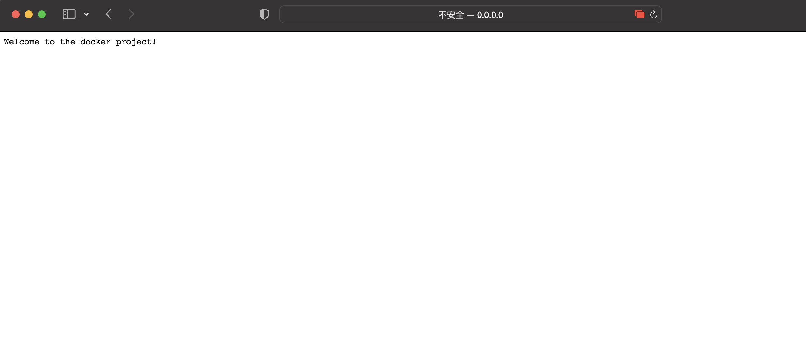
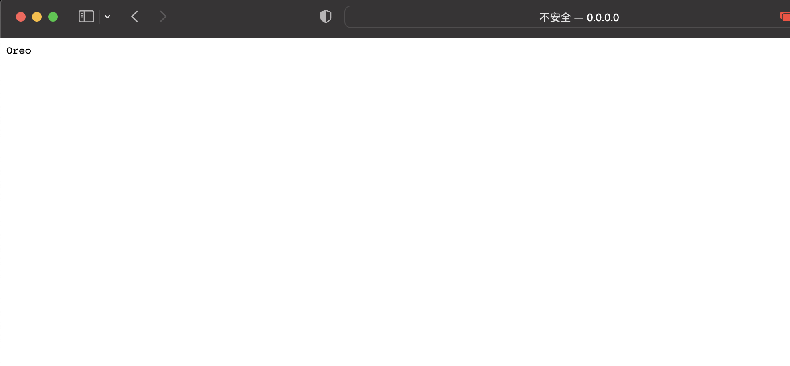

# Rust demo project3
This is a demo project based on the rust-mlops-template

## Introduction
This is a mini rust microservice which can return a random name to the user. This project also can use dockerfile to containerize, and to be deployed on AWS.

## Usage
User can use ```cargo run``` to start testing on local. 
Two routes are ```/``` and ```/name```.
## ScreenShots
For welcoming page:

For get random name page:

## References

* [rust-cli-template](https://github.com/kbknapp/rust-cli-template)
